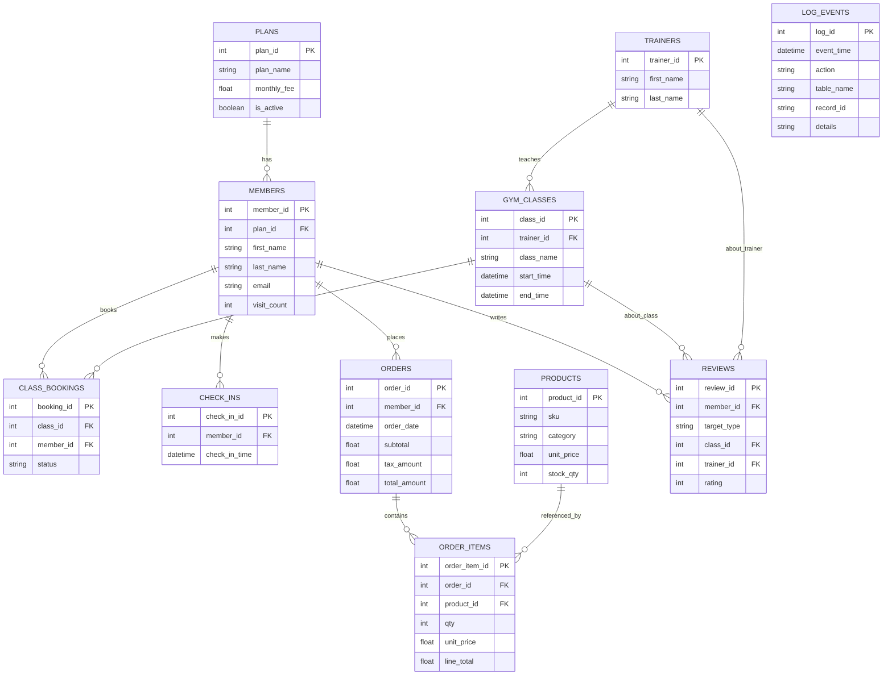

# Gym & Classes — Data Storage & Retrieval Project (MySQL 8)

Comprehensive relational database for a Gym & Classes business. The project is designed for NOVA IMS “Data Storage & Retrieval” and demonstrates relational design, normalization up to 3NF/BCNF, transactional integrity, triggers, views, realistic seed data across two years, and analytical queries for business stakeholders.

The deliverable is a single, reproducible SQL file (`project.sql`) plus a minimal Docker Compose setup to run MySQL 8 locally.

---

## Table of Contents
- [Gym \& Classes — Data Storage \& Retrieval Project (MySQL 8)](#gym--classes--data-storage--retrieval-project-mysql-8)
  - [Table of Contents](#table-of-contents)
  - [Executive Summary](#executive-summary)
  - [Business Scenario](#business-scenario)
  - [Tech Stack](#tech-stack)
  - [Project Structure](#project-structure)
  - [Quickstart](#quickstart)
  - [Schema Overview](#schema-overview)
  - [Entity–Relationship Diagram](#entityrelationship-diagram)
  - [Normalization Notes](#normalization-notes)
  - [Triggers](#triggers)
  - [Invoice Views](#invoice-views)
  - [Seed Data](#seed-data)
  - [CEO/Analytical Queries](#ceoanalytical-queries)
  - [How to Demo](#how-to-demo)
  - [Indexes \& Performance](#indexes--performance)
  - [Data Quality \& Constraints](#data-quality--constraints)
  - [Assessment Rubric Mapping](#assessment-rubric-mapping)
  - [Extending the Schema](#extending-the-schema)
  - [Troubleshooting](#troubleshooting)
  - [Acknowledgments](#acknowledgments)

---

## Executive Summary
This database models a small gym that sells memberships, runs scheduled classes led by trainers, processes point‑of‑sale merchandise orders, tracks member check‑ins, and collects ratings for classes and trainers. Key design highlights:
- 11 tables with clear primary/foreign keys and constraints.
- Two business triggers (visit counter on check‑in; inventory decrement + audit log on merch sales) and two validation triggers for review consistency.
- Two invoice views to generate printable invoice headers and lines without duplicating data.
- Seeded with plausible transactions spanning 2024–2025 to support time‑series KPIs.
- Five “CEO” queries that demonstrate GROUP BY and JOINs for practical insights.

---

## Business Scenario
The gym sells memberships, hosts classes led by trainers, and sells merchandise. Members check in, book classes, and can rate either a class or a trainer. Invoices are generated on demand from views (not stored as physical tables). The schema is intentionally compact yet realistic to illustrate core relational patterns for OLTP and downstream analytics.

---

## Tech Stack
- MySQL 8.x (tested with 8.0)
- Docker Compose (single‑command local DB)
- Single SQL deliverable: `project.sql`

---

## Project Structure

```
.
├── docker-compose.yml     # MySQL 8 container for local development
├── project.sql            # Full DDL + triggers + seed data + views + sample queries
├── Demo.md                # Walkthrough of demo queries (triggers, invoices, KPIs)
└── readme.md              # This document
```

---

## Quickstart

Default MySQL credentials inside the container: `root` / `root`.

1) Start MySQL
```bash
docker compose up -d
```

2) Import everything (schema, triggers, seed data, views, queries)
```bash
docker compose exec db sh -lc 'mysql < /repo/project.sql'
```

3) Verify database exists
```bash
docker compose exec db sh -lc 'mysql -e "SHOW DATABASES LIKE \"gym_mgmt\";"'
```

Optional: open an interactive MySQL shell
```bash
docker compose exec -it db mysql -uroot -proot
```

Alternative (host client): if you have a local MySQL client, you can import directly:
```bash
mysql -h 127.0.0.1 -P 3306 -uroot -proot < project.sql
```

---

## Schema Overview

Core entities and relationships (11 tables):
- plans: membership plans and pricing
- members: customers enrolled in plans; check‑ins accumulate visit_count
- trainers: staff who lead classes
- gym_classes: scheduled classes with trainer, room, and capacity
- class_bookings: member reservations with attendance status
- check_ins: member arrivals; drive a visit_count trigger
- products: catalog of merchandise/memberships/class products
- orders: invoice header; generated total column
- order_items: invoice lines; generated line_total
- reviews: 1–5 ratings for classes or trainers (mutually exclusive FKs)
- log_events: audit log (JSON details for stock decrements)

Key generated columns:
- orders.total_amount = subtotal + tax_amount
- order_items.line_total = qty * unit_price

---

## Entity–Relationship Diagram



---

## Normalization Notes

The schema adheres to 1NF/2NF/3NF and is compatible with BCNF:
- 1NF: all attributes are atomic; repeating groups are separated (e.g., order_items split from orders; bookings split from classes).
- 2NF: no partial dependencies on composite keys (surrogate PKs are used; unique constraints enforce natural keys where appropriate, e.g., `members.email`, `products.sku`).
- 3NF/BCNF: no transitive dependencies (e.g., computed totals are generated columns, not stored redundantly; plan data is factored from members; trainer and class attributes are in separate relations). Validation triggers enforce the XOR relationship on `reviews` for class vs trainer targets.

---

## Triggers

Business triggers (required by the brief):
- `trg_checkins_after_insert` (AFTER INSERT on `check_ins`): increments `members.visit_count` for the arriving member.
- `trg_order_items_after_insert` (AFTER INSERT on `order_items`): if the product category is `Merch`, decrements `products.stock_qty` and writes an audit record to `log_events` with JSON details.

Validation triggers (extra):
- `trg_reviews_bi_validate` and `trg_reviews_bu_validate`: enforce that `reviews.target_type` matches exactly one foreign key (`class_id XOR trainer_id`). Invalid rows are rejected with a clear error message.

Trigger design choices: work is idempotent and row‑level; business triggers avoid recomputing invoice totals (handled via generated columns + header recompute statements in seeds), while validation triggers ensure data integrity for polymorphic reviews.

---

## Invoice Views

Two views expose invoices in a reporting‑friendly shape without duplicating data:
- `invoice_head_v`: one row per order with member info and header totals.
- `invoice_lines_v`: normalized lines with product SKU/name/category, quantities, and line totals; includes a windowed `line_no` for ordering.

These are intended for downstream export/printing and analytics tooling.

---

## Seed Data

`project.sql` seeds:
- Members, trainers, and plans with realistic attributes.
- Classes scheduled across 2024 and 2025.
- Bookings with various attendance outcomes.
- Orders and order_items covering merchandise, memberships, and class drop‑ins.
- Reviews for both classes and trainers.

Totals are computed via generated columns with one final recompute of `orders.subtotal` and `orders.tax_amount` demonstrated in the script.

---

## CEO/Analytical Queries

Included end‑of‑file queries demonstrate common business analytics:
- Top 5 customers by revenue (JOIN + GROUP BY)
- Monthly revenue trend (time series across two years)
- Product mix by revenue (category breakdown)
- Trainer ratings (average stars and counts)
- Class attendance conversion (booked → attended rate)

These can be reused as building blocks for dashboards.

---

## How to Demo

Use `Demo.md` for a guided demo of triggers, stock logging, invoice views, and simple KPIs. Example excerpts (run inside the container shell):

1) Open a MySQL shell
```bash
docker compose exec -it db mysql -uroot -proot gym_mgmt
```

2) Demonstrate Trigger #1 (check‑ins → visit_count++)
```sql
START TRANSACTION;
SELECT member_id, CONCAT(first_name,' ',last_name) AS name, visit_count
FROM members WHERE member_id=2;

INSERT INTO check_ins (member_id, check_in_time, location)
VALUES (2, NOW(), 'Front Desk');

SELECT member_id, CONCAT(first_name,' ',last_name) AS name, visit_count
FROM members WHERE member_id=2;
ROLLBACK;
```

3) Demonstrate Trigger #2 (order_items on Merch → stock-- + log)
```sql
START TRANSACTION;
SELECT sku, stock_qty FROM products WHERE sku IN ('M-TEE','M-BOT');

INSERT INTO orders (member_id, order_date, status, payment_method)
VALUES (1, NOW(), 'paid', 'card');
SET @oid := LAST_INSERT_ID();

INSERT INTO order_items (order_id, product_id, description, qty, unit_price)
SELECT @oid, product_id, 'Demo T-Shirt', 1, unit_price
FROM products WHERE sku='M-TEE';

-- recompute header for demo (subtotal/tax)
UPDATE orders o
JOIN (SELECT order_id, SUM(line_total) AS subtotal FROM order_items WHERE order_id=@oid) s
  ON s.order_id = o.order_id
SET o.subtotal = s.subtotal, o.tax_amount = ROUND(s.subtotal*0.23, 2);

SELECT sku, stock_qty FROM products WHERE sku IN ('M-TEE','M-BOT');
SELECT action, table_name, record_id, details
FROM log_events
WHERE JSON_EXTRACT(details,'$.order_id') = @oid;
ROLLBACK;
```

4) Invoice views
```sql
SELECT * FROM invoice_head_v ORDER BY order_id LIMIT 5;
SELECT * FROM invoice_lines_v WHERE order_id = 1;
```

5) KPIs
```sql
SELECT m.member_id, CONCAT(m.first_name,' ',m.last_name) AS member, SUM(o.total_amount) AS total_revenue
FROM orders o JOIN members m ON m.member_id=o.member_id
GROUP BY m.member_id, member ORDER BY total_revenue DESC LIMIT 5;

SELECT DATE_FORMAT(order_date, '%Y-%m') AS ym, SUM(total_amount) AS revenue
FROM orders GROUP BY ym ORDER BY ym;
```

See `Demo.md` for more.

---

## Indexes & Performance

The following indexes support common access paths and analytics:
- `ix_class_time` on `gym_classes(start_time)`
- `ix_booking_member` and `ix_bookings_class_status` on `class_bookings`
- `ix_checkins_member_time` on `check_ins(member_id, check_in_time)`
- `ix_orders_member_date` and `ix_orders_date` on `orders`
- `ix_products_active` on `products(is_active)`
- `ix_reviews_member_time`, `ix_reviews_trainer_type`, `ix_reviews_class_type` on `reviews`

Design notes:
- Date/time indexes accelerate monthly revenue and recent activity queries.
- Covering composite keys match typical WHERE/GROUP BY patterns.
- Generated columns avoid write‑time inconsistencies while enabling simple aggregations.

---

## Data Quality & Constraints

Constraints and checks contribute to data integrity:
- NOT NULL and `CHECK` constraints on monetary and temporal fields (e.g., non‑negative prices; `end_time > start_time`; `rating BETWEEN 1 AND 5`).
- `UNIQUE` constraints on business keys (`members.email`, `products.sku`).
- `FOREIGN KEY` constraints with appropriate `ON UPDATE`/`ON DELETE` actions.
- Validation triggers enforce XOR logic on `reviews`.

---

## Assessment Rubric Mapping

- ≥ 8 tables: 11 total (`plans`, `members`, `trainers`, `gym_classes`, `class_bookings`, `check_ins`, `products`, `orders`, `order_items`, `reviews`, `log_events`).
- Normalization 1NF–3NF (+BCNF compatibility): see [Normalization Notes](#normalization-notes).
- Ratings feature: `reviews` table with 1–5 stars targeting classes or trainers.
- 2 triggers (business): `trg_checkins_after_insert`, `trg_order_items_after_insert` (+2 validation triggers for robustness).
- Invoices via 2 views: `invoice_head_v`, `invoice_lines_v`.
- Transactions across ≥ 2 consecutive years: seeds cover 2024 and 2025 for classes and orders.
- 5 CEO queries: end‑of‑file analytical queries for revenue, mix, ratings, and attendance.

---

## Extending the Schema

Ideas to evolve the system:
- Add subscriptions/billing cycles for auto‑renewing memberships.
- Introduce `payments` with gateways, refunds, and reconciliation.
- Track class waitlists and overbooking rules.
- Role‑based access control with users/roles/permissions.
- Soft deletes and row‑level audit across more tables.
- Materialized summary tables or scheduled ETL for BI workloads.

---

## Troubleshooting

- Port 3306 already in use: stop local MySQL or change the published port in `docker-compose.yml`.
- Authentication errors: credentials are `root`/`root` by default; ensure you are connecting to `127.0.0.1` and not a socket.
- Import errors about unknown database: ensure the container is healthy (`docker ps` then `docker compose logs db`), and re‑run the import once `mysqladmin ping` reports ready.
- Trigger or FK errors during custom inserts: check `reviews` XOR validation and referential integrity on class/member IDs.

---

## Acknowledgments

Developed for NOVA IMS — Data Storage & Retrieval. MySQL 8 features used: generated columns, `CHECK` constraints, window functions in views, and JSON in audit logs.
